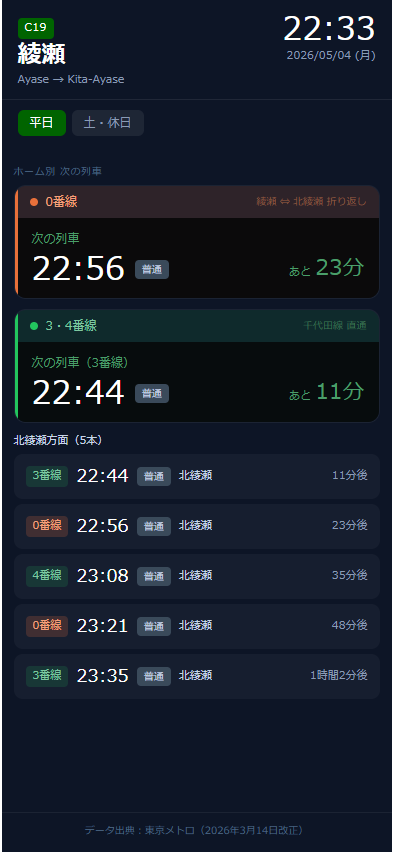
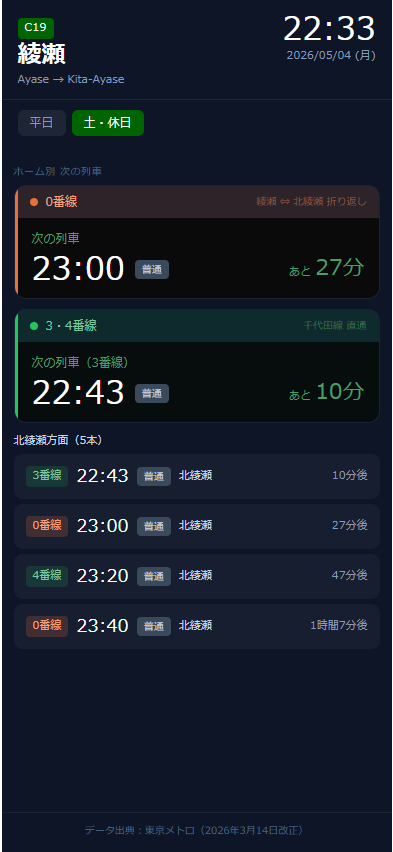

# 設計書（確定版）

**プロジェクト名**：ayase-kitaayase-timetable
**作成日**：2026-05-04
**バージョン**：1.0
**保存先**：`C:\_claude\projects\ayase-kitaayase-timetable\docs\design.md`

> ⚠️ このドキュメントはソースコード・ユニットテストと常に同期を保つこと
> 変更時は3点セット（ソース・テスト・設計書）を同時に更新する

---

## 1. 概要

| 項目 | 内容 |
|---|---|
| アプリ名 | 綾瀬 発車案内 |
| 目的 | 綾瀬駅で北綾瀬行きに乗り換える際、次の列車のホームと発車時刻を素早く確認する |
| 対象ユーザー | 個人利用 |
| 使用タイミング | 綾瀬駅での乗り換え時 |
| URL | https://ayase-kitaayase-timetable.vercel.app/ |
| リポジトリ | https://github.com/nui1971/ayase-kitaayase-timetable |

---

## 2. 画面仕様（確定版）

### 画面イメージ

| 平日 | 土・休日 |
|:---:|:---:|
|  |  |

---

### 画面構成

| # | 領域 | 内容 |
|---|---|---|
| 1 | ヘッダー | 路線記号（C19）・駅名・ローマ字表記／現在時刻・日付（曜日） |
| 2 | ダイヤバッジ | 「平日」「土・休日」の切り替えタブ（自動＋手動） |
| 3 | 次の列車カード（0番線） | 番線・発車時刻・種別バッジ・あと何分 |
| 4 | 次の列車カード（3・4番線） | 番線・発車時刻・種別バッジ・あと何分 |
| 5 | 列車リスト | 5本固定表示（番線・時刻・種別・XX分後） |
| 6 | フッター | データ出典表記 |

---

### 2-1. 全体

| 要素 | 値 |
|---|---|
| 背景色 | `#0d1526` |
| フォント | sans-serif |
| 最大幅 | 390px（iPhone 15 Pro 基準）・中央揃え |
| 画面構成 | 1画面完結（画面遷移なし・スクロールのみ） |

---

### 2-2. ヘッダー

| 要素 | 値 |
|---|---|
| padding | 14px 16px 10px |
| border-bottom | 0.5px solid rgba(255,255,255,0.08) |
| C19バッジ | background `#006400`・color `#fff`・font-size 11px・font-weight 500・padding 2px 7px・border-radius 4px |
| 駅名「綾瀬」 | color `#fff`・font-size 24px・font-weight 700 |
| ローマ字「Ayase → Kita-Ayase」 | color `#8a9bb5`・font-size 11px・margin-top 2px |
| 現在時刻 | color `#fff`・font-size 32px・font-weight 300（秒なし・1分ごと更新） |
| 日付 | color `#8a9bb5`・font-size 11px・右寄せ・形式：YYYY/MM/DD (曜) |

---

### 2-3. ダイヤバッジエリア

| 要素 | 値 |
|---|---|
| padding | 10px 16px 4px |
| 選択中バッジ | background `#006400`・color `#fff`・font-size 12px・font-weight 500・padding 4px 12px・border-radius 6px |
| 非選択バッジ | background `rgba(255,255,255,0.07)`・color `#8a9bb5`・font-size 11px |
| 自動切替 | 月〜金：平日・土日祝：土・休日 |
| 手動切替 | タップで切替可能 |

---

### 2-4. 次の列車カード（共通仕様）

| 要素 | 値 |
|---|---|
| コンポーネント | `TrackCard.tsx` |
| border-radius | 12px |
| border | 0.5px solid rgba(255,255,255,0.06) |
| 構造 | 左縦線（3px）＋カードヘッダー＋カード本体 |
| 「次の列車」ラベル | color `#4a9e6a`・font-size 12px |
| 時刻 | color `#fff`・font-size 32px・font-weight 300 |
| 種別バッジ | 下記バッジ仕様参照 |
| レイアウト | 時刻・種別バッジ・あと何分を1行横並び |
| 「あとXX分」 | color `#4a9e6a`・font-size 22px・font-weight 500・右寄せ |
| 終電済み表示 | 時刻部分に「終電済」を表示 |

#### 0番線カード

| 要素 | 値 |
|---|---|
| 左縦線 | `#e8703a`（オレンジ） |
| カードヘッダー背景 | `rgba(232,112,58,0.15)` |
| カードヘッダー番線名 | color `#f5a07a` |
| カードヘッダー補足 | 「綾瀬 ⇔ 北綾瀬 折り返し」・color `#8a5a40` |
| カード本体背景 | `rgba(10,8,6,0.85)` |

#### 3・4番線カード

| 要素 | 値 |
|---|---|
| 左縦線 | `#22c55e`（グリーン） |
| カードヘッダー背景 | `rgba(34,197,94,0.12)` |
| カードヘッダー番線名 | color `#7ec8a0` |
| カードヘッダー補足 | 「千代田線 直通」・color `#3a7050` |
| カード本体背景 | `rgba(6,10,8,0.85)` |
| 次の列車ラベル | 「次の列車（3番線）」または「次の列車（4番線）」と番線を明示 |

---

### 2-5. 種別バッジ

| 種別 | background | color |
|---|---|---|
| 普通 | `#3a4a5a` | `#c8d6e8` |
| 準急 | `#1a3a7a` | `#90b8f0` |
| 急行 | `#7a1a1a` | `#f09090` |

共通：font-size 10px・font-weight 500・padding 2px 7px・border-radius 4px・white-space nowrap

---

### 2-6. 列車リスト

| 要素 | 値 |
|---|---|
| ヘッダー | 「北綾瀬方面（5本）」・color `#c8d6e8`・font-size 11px・font-weight 500 |
| 各行 padding | 9px 12px・border-radius 9px |
| 各行背景 | `rgba(255,255,255,0.04)`（全行均一・ハイライトなし） |
| 番線バッジ（0番線） | background `rgba(232,112,58,0.2)`・color `#f5a07a` |
| 番線バッジ（3・4番線） | background `rgba(34,197,94,0.15)`・color `#7ec8a0` |
| 時刻 | color `#fff`・font-size 18px・font-weight 300・min-width 46px |
| 行き先 | 「北綾瀬」・color `#c8d6e8`・font-size 11px |
| XX分後 | color `#8a9bb5`・font-size 11px・font-weight 500 |
| 表示本数 | 5本固定 |

---

### 2-7. あと何分の表示形式

| 条件 | 表示形式 |
|---|---|
| 60分未満 | 「XX分」／リストは「XX分後」 |
| 60分ちょうど | 「1時間」／リストは「1時間後」 |
| 60分超 | 「1時間XX分」／リストは「1時間XX分後」 |

---

### 2-8. フッター

| 要素 | 値 |
|---|---|
| padding | 10px 16px 14px |
| border-top | 0.5px solid rgba(255,255,255,0.06) |
| テキスト | 「データ出典：東京メトロ（2026年3月14日改正）」 |
| font-size | 10px・color `#4a6580`・中央揃え |

---

## 3. 機能仕様

### 3-1. 現在時刻管理

| 項目 | 仕様 |
|---|---|
| タイムゾーン | Asia/Tokyo（日本時間） |
| 更新頻度 | 1分ごと |
| カスタムフック | `useCurrentTime.ts` |

---

### 3-2. 列車フィルタリング

**入力**

```typescript
trains: Train[]
now: { hour: number, minute: number }
```

**処理**

```
1. 現在時刻より後の列車を抽出
2. platform === 0 の次の列車を取得
3. platform === 3 | 4 の次の列車を取得
4. 上位5本のリストを生成
```

**出力**

```typescript
{ nextP0: Train | null, nextP34: Train | null, upcomingList: Train[] }
```

---

### 3-3. 祝日判定

| 項目 | 値 |
|---|---|
| API | `https://holidays-jp.github.io/api/v1/{year}/date.json` |
| 取得タイミング | アプリ起動時（当年・翌年を並列取得） |
| キャッシュ | sessionStorage・キー：`holidays_YYYY` |
| 失敗時 | 空セットを使用（土日のみで判定） |

**判定ロジック（`getDayType(date, holidays)`）**

```
土曜 OR 日曜          → 土休日ダイヤ
holidays に含まれる日 → 土休日ダイヤ
それ以外              → 平日ダイヤ
```

---

## 4. データ仕様

### 4-1. 型定義

```typescript
export type TrainType = '普通' | '準急' | '急行'
export type DayType = 'weekday' | 'holiday'
export type Platform = 0 | 3 | 4

export interface Train {
  hour: number       // 0〜23
  minute: number     // 0〜59
  platform: Platform // 0=折り返し, 3=3番線直通, 4=4番線直通
  trainType: TrainType
}

export interface Timetable {
  weekday: Train[]
  holiday: Train[]
}
```

---

### 4-2. 時刻表データ

| 項目 | 内容 |
|---|---|
| データソース | 東京メトロ公式時刻表（2026年3月14日改正） |
| 管理方法 | `src/data/timetable.ts` にハードコード |
| API連携 | なし（ODPTは途中駅データ未対応のため不採用） |
| ダイヤ改正時 | 公式サイト確認 → timetable.ts を手動更新 |

**番線の定義**

| 番線 | 種別 | 備考 |
|---|---|---|
| 0番線 | 折り返し | 綾瀬始発・北綾瀬終点 |
| 3番線 | 千代田線直通 | 代々木上原方面から直通 |
| 4番線 | 千代田線直通 | 代々木上原方面から直通 |

---

## 5. 技術スタック（確定版）

| レイヤー | 技術 | バージョン |
|---|---|---|
| フレームワーク | React | v19.x |
| 言語 | TypeScript | v5.8.x |
| ビルドツール | Vite | v8.x |
| CSSフレームワーク | TailwindCSS | v4.x |
| テスト | Vitest + React Testing Library | v4.x |
| PWA | vite-plugin-pwa | - |
| ホスティング | Vercel（無料プラン） | - |
| バージョン管理 | GitHub（Public） | - |

---

## 6. ファイル構成

```
ayase-kitaayase-timetable/
├── src/
│   ├── data/
│   │   └── timetable.ts          # 時刻表データ・型定義
│   ├── components/
│   │   ├── Header.tsx             # ヘッダー（駅名・現在時刻）
│   │   ├── DayBadge.tsx           # 平日／土休日バッジ
│   │   ├── TypeBadge.tsx          # 種別バッジ（普通・準急・急行）
│   │   ├── TrackCard.tsx          # 次の列車カード（0番線・3・4番線共用）
│   │   ├── TrainRow.tsx           # 列車リスト1行
│   │   ├── TrainList.tsx          # 列車リスト全体
│   │   └── Footer.tsx             # フッター
│   ├── hooks/
│   │   ├── useCurrentTime.ts      # 現在時刻（1分ごと更新）
│   │   ├── useDayType.ts          # 平日/土休日判定・祝日API
│   │   └── useTrains.ts           # 列車フィルタリング
│   ├── utils/
│   │   └── formatTime.ts          # 時刻・残り分フォーマット
│   ├── App.tsx
│   ├── index.css
│   └── main.tsx
├── docs/
│   ├── design.md                  # このファイル（設計書確定版）
│   └── mock.html                  # HTMLモック
├── public/
│   ├── icon-192.png
│   └── icon-512.png
├── .env                           # 環境変数（Git管理外）
├── .env.example                   # 環境変数サンプル
├── vite.config.ts
├── tsconfig.app.json
└── package.json
```

---

## 7. PWA設定

| 項目 | 値 |
|---|---|
| name | 綾瀬 発車案内 |
| short_name | 綾瀬→北綾瀬 |
| theme_color | `#0d1526` |
| background_color | `#0d1526` |
| display | standalone |
| 対象端末 | iPhone 15 Pro（Safari・ホーム画面に追加） |

---

## 8. 運用ルール

### デプロイ手順

```powershell
npm run build
git add .
git commit -m "fix: [変更内容]"
git push
# → Vercel が自動でビルド・デプロイ（約30秒）
```

### 更新時のルール

```
コード変更
  → ユニットテストを更新（npm run test:run で確認）
  → 設計書（このファイル）を更新
  → git push
```

### ダイヤ改正時の対応

```
1. 東京メトロ公式サイトで新ダイヤを確認
2. src/data/timetable.ts を更新
3. フッターのデータ出典日付を更新
4. npm run build で確認 → git push
```

---

## 9. 設計上の決定事項

| # | 決定事項 | 理由 |
|---|---|---|
| 1 | 時刻表データはハードコード | ODPTは始発駅基準のため途中駅（綾瀬）のデータなし。NAVITIME等は法人契約必須で個人利用不可 |
| 2 | ODPT API不採用 | 綾瀬駅（途中駅）の時刻・番線データをAPIで取得できるサービスが個人利用無料では存在しない |
| 3 | 番線はハードコードで管理 | 0番線（折り返し）と3・4番線（直通）はダイヤ構造上固定 |
| 4 | 列車リストは5本固定 | 乗り換え時の素早い確認がユースケースのため展開機能は不要 |
| 5 | フィルター機能なし | 行き先は北綾瀬のみで絞り込み不要 |

---

## 10. 既知の問題・今後の課題

| # | 内容 | 優先度 | 状態 |
|---|---|---|---|
| 1 | ユニットテスト未実装 | 🔴 | 対応予定 |
| 2 | 終電後の翌日ダイヤ切替 | 🟡 | 未対応 |
| 3 | オフライン対応 | ⚪ | 将来対応 |

---

## 11. 変更履歴

| 日付 | バージョン | 変更内容 |
|---|---|---|
| 2026-05-04 | 1.0 | 初版作成（実装・デプロイ完了後） |
